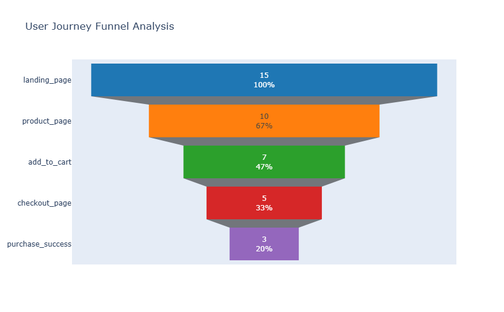

# 📊 E-Commerce User Journey Funnel Analysis

## 📝 Project Overview
This project analyzes user behavior data to track the customer journey on an e-commerce platform. By processing raw event logs, the script visualizes the conversion funnel, calculates drop-off rates at each stage, and identifies critical bottlenecks where users are leaving the platform.

The goal is to provide data-driven insights to improve **Conversion Rate Optimization (CRO)** and enhance User Experience (UX).

## 🚀 Key Features
* **End-to-End Pipeline:** Ingests raw CSV data, processes it using Pandas, and visualizes it.
* **Metric Calculation:** Automatically computes:
    * Step-by-step Conversion Rates.
    * Drop-off Rates (Churn).
    * Overall Funnel Conversion Rate.
* **Bottleneck Detection:** Logic to identify the specific stage causing the highest user loss.
* **Interactive Visualization:** Generates a dynamic Funnel Chart using Plotly.

## 📂 Dataset
The project uses a dataset (`user_data.csv`) containing user event logs with the following columns:
* `user_id`: Unique identifier for the user.
* `stage`: The step of the funnel (Landing Page, Product Page, Cart, Checkout, Purchase).
* `timestamp`: Time of the event.
* `device`: Mobile or Desktop.

## 📊 Project Output (Visualization)
Below is the Funnel Chart generated by the analysis, showing the user flow from Landing Page to Purchase.



*(Note: The chart above shows that the maximum drop-off occurs at the **Add to Cart** stage, indicating a potential pricing or UI issue.)*

## 🛠️ Tech Stack
* **Python 3.x**
* **Pandas** (Data Manipulation)
* **Plotly** (Data Visualization)
* **NumPy** (Numerical Operations)

## ⚙️ How to Run
1.  Clone this repository.
2.  Install the required libraries:
    ```bash
    pip install pandas plotly
    ```
3.  Ensure `user_data.csv` is in the root directory.
4.  Run the analysis script:
    ```bash
    python funnel_analysis.py
    ```

## 📈 Sample Insights
Based on the sample data analysis:
* **Total Visitors:** 15
* **Final Purchases:** 3
* **Overall Conversion Rate:** 20%
* **Major Bottleneck:** Identified at the **Checkout Page** with a 40% drop-off rate.

